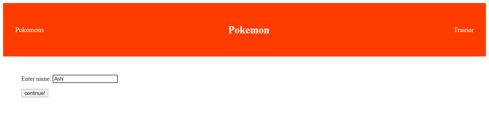
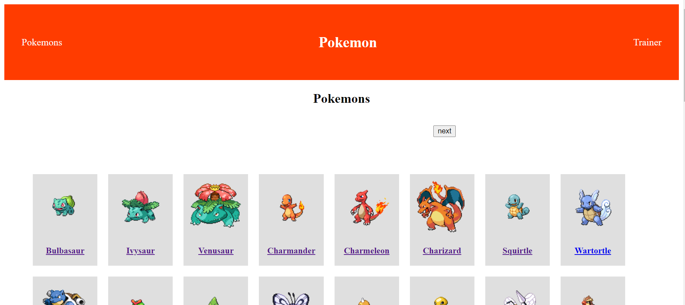
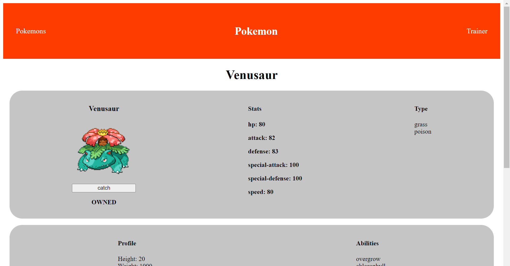
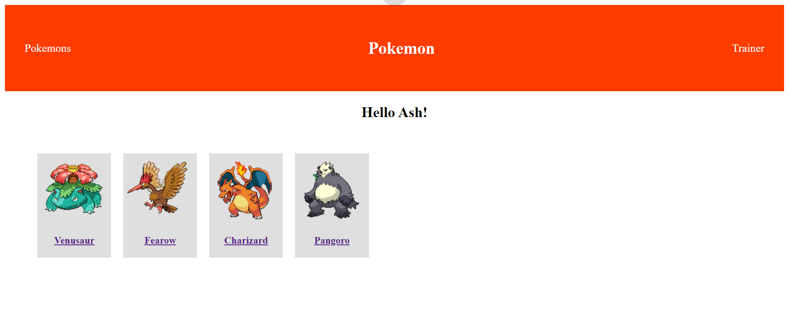

# PokemonTrainer
Angular pokemon application. Pokemon trainer can browser all pokemons and collect them.

## Table of contents
- [PokemonTrainer](#pokemontrainer)
  - [Table of contents](#table-of-contents)
  - [About](#about)
    - [Application](#application)
      - [Login](#login)
      - [Pokemons page](#pokemons-page)
      - [Pokemon page](#pokemon-page)
      - [Trainer page](#trainer-page)
  - [Install & usage](#install--usage)
  - [Angular template](#angular-template)
    - [Development server](#development-server)
    - [Code scaffolding](#code-scaffolding)
    - [Build](#build)
    - [Running unit tests](#running-unit-tests)
    - [Running end-to-end tests](#running-end-to-end-tests)
    - [Further help](#further-help)


[Top &#8593;](#pokemontrainer)
## About
Full description of the application can be found [here](documents/JavaScript_Pokemon_Trainer.pdf).

Application is an Angular front end application. Pokemon trainer can browser and collect Pokemons.

[Top &#8593;](#pokemontrainer)
### Application
#### Login
Initial page shown to user is the login page.

Here user is asked to enter his/hers trainer name.
After entering valid username the username is stored in local storage and user is redirected to Pokemons page.

[Top &#8593;](#pokemontrainer)
#### Pokemons page
Here user is shown a 100 pokemons per page.

User is able to navigate Pokemons. Clicking a Pokemon redirects user to that Pokemon page. User can always navigate back to Pokemons page using the nav bar. This page is also the default page for the application.

This page is shown only if user has entered a valid username.

[Top &#8593;](#pokemontrainer)
#### Pokemon page
All information related to specific Pokemon is found here.

Here user can see Pokemons stats, type, profile, abilities and moves.

User can catch a Pokemon using the "catch" button. This adds current Pokemon to users collection. The collection can be seen from the trainer page.

[Top &#8593;](#pokemontrainer)
#### Trainer page
Trainer page show a collection of collected Pokemons to user.


[Top &#8593;](#pokemontrainer)
## Install & usage
Application is build using Angular version 11.

You should be able to clone the [repository](https://github.com/veliValentine/pokemon-trainer.git).

After copying repository, install Angular client and

```run ng serve --open```

For more information see [Angular template](#angular-template)

[Top &#8593;](#pokemontrainer)
<hr/>

## Angular template

  - [Development server](#development-server)
  - [Code scaffolding](#code-scaffolding)
  - [Build](#build)
  - [Running unit tests](#running-unit-tests)
  - [Running end-to-end tests](#running-end-to-end-tests)
  - [Further help](#further-help)

This project was generated with [Angular CLI](https://github.com/angular/angular-cli) version 11.2.3.

[Top &#8593;](#pokemontrainer)
### Development server

Run `ng serve` for a dev server. Navigate to `http://localhost:4200/`. The app will automatically reload if you change any of the source files.

[Top &#8593;](#pokemontrainer)
### Code scaffolding

Run `ng generate component component-name` to generate a new component. You can also use `ng generate directive|pipe|service|class|guard|interface|enum|module`.

[Top &#8593;](#pokemontrainer)
### Build

Run `ng build` to build the project. The build artifacts will be stored in the `dist/` directory. Use the `--prod` flag for a production build.

[Top &#8593;](#pokemontrainer)
### Running unit tests

Run `ng test` to execute the unit tests via [Karma](https://karma-runner.github.io).

[Top &#8593;](#pokemontrainer)
### Running end-to-end tests

Run `ng e2e` to execute the end-to-end tests via [Protractor](http://www.protractortest.org/).

[Top &#8593;](#pokemontrainer)
### Further help

To get more help on the Angular CLI use `ng help` or go check out the [Angular CLI Overview and Command Reference](https://angular.io/cli) page.
